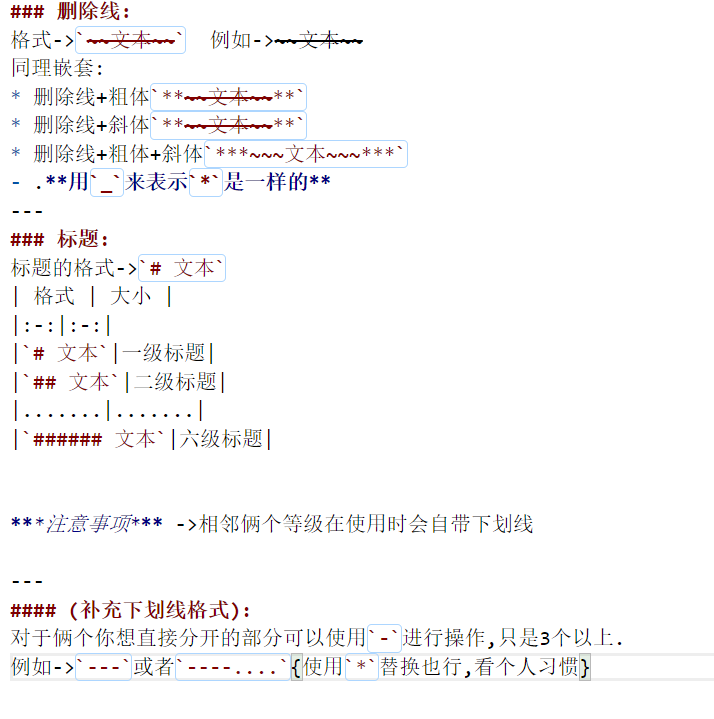

## 基础语法讲解(二)  
>* 删除线:
>    1. 删除线
>    2. 删除线+粗体
>    3. 删除线+斜体
>    4. 删除线+粗体+斜体
>* 标题:
>    1. 标题结构
>    2. 标题注意事项  

### 删除线:  
格式->`~~文本~~`  例如->~~文本~~
同理嵌套:
* 删除线+粗体`**~~文本~~**`
* 删除线+斜体`**~~文本~~**`
* 删除线+粗体+斜体`***~~~文本~~~***`
- .**用`_`来表示`*`是一样的**
---
### 标题:
标题的格式->`# 文本`
| 格式 | 大小 |
|:-:|:-:|
|`# 文本`|一级标题|
|`## 文本`|二级标题|
|.......|.......|
|`###### 文本`|六级标题|  

***注意事项*** ->相邻俩个等级在使用时会自带下划线

---
#### (补充下划线格式):
对于俩个你想直接分开的部分可以使用`-`进行操作,只是3个以上.
例如->`---`或者`----....`{使用`*`替换也行,看个人习惯}

---

