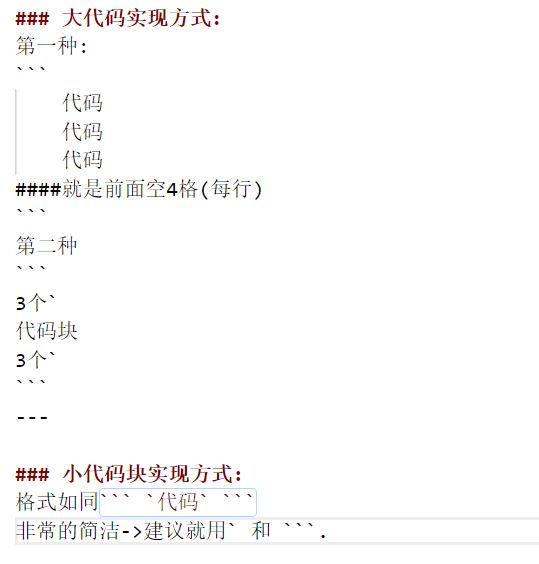

## 代码块
>* 大代码块实现方式
>    1. 实现方式(1)
>    2. 实现方式(2)
>* 小代码块实现方式
### 大代码实现方式:
第一种:
```
    代码
    代码
    代码
####就是前面空4格(每行)
```
第二种
```
3个`
代码块
3个`
```
---

### 小代码块实现方式:
格式如同``` `代码` ```
非常的简洁->建议就用` 和 ```.

---
