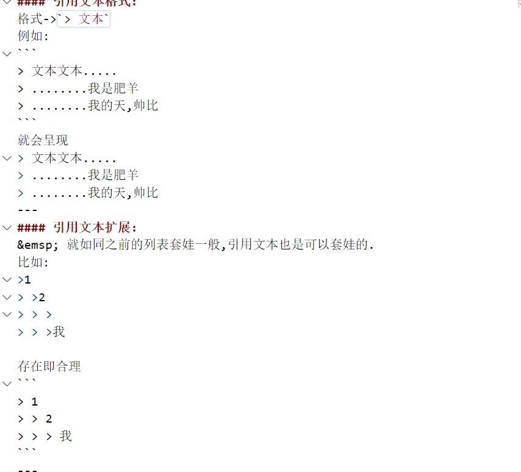

## 引用文本
>* 引用文本的格式
>* 引用文本的扩展
---
#### 引用文本格式:
格式->`> 文本`
例如:
```
> 文本文本.....
> ........我是肥羊
> ........我的天,帅比
```
就会呈现
> 文本文本.....
> ........我是肥羊
> ........我的天,帅比
---
#### 引用文本扩展:
&emsp; 就如同之前的列表套娃一般,引用文本也是可以套娃的.
比如:
>1
> >2
> > >
> > >我

存在即合理
```
> 1
> > 2
> > > 我
```
---
