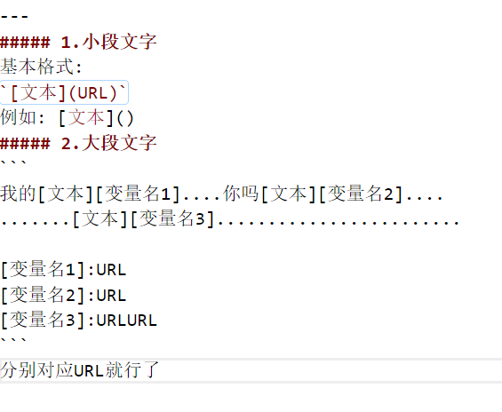

## 超链接
* 超链接的俩种格式
---
##### 1.小段文字
基本格式:
`[文本](URL)`
例如: [文本]()
##### 2.大段文字
```
我的[文本][变量名1]....你吗[文本][变量名2]....
.......[文本][变量名3]........................

[变量名1]:URL
[变量名2]:URL
[变量名3]:URLURL
```
分别对应URL就行了

---
